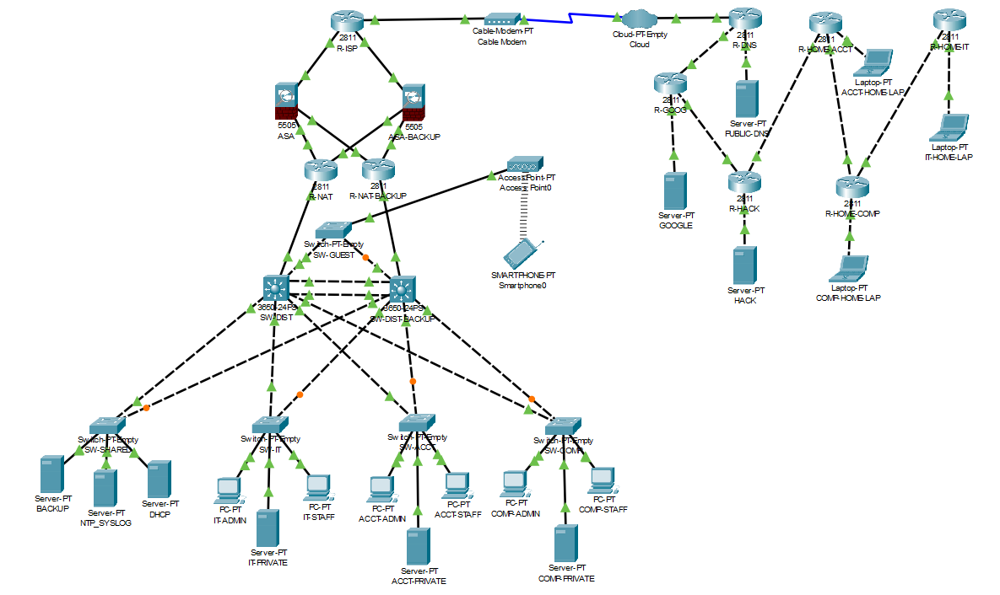

# Enterprise Network Simulation – Cisco Packet Tracer

A full-scale enterprise network built from the ground up in Cisco Packet Tracer, designed to simulate a realistic corporate infrastructure — complete with departmental segmentation, security hardening, remote access, and redundancy at every critical layer.

This project was developed during a one-month networking internship at **[Esterad Bank Bahrain](https://www.linkedin.com/company/esteradbank/)** as a hands-on capstone applying core networking and security concepts to a single connected environment.

> ⚠️ All IP addressing, hostnames, and configurations in this project are for **simulation and learning purposes only** and do not reflect any real production network.

## 📷 Network Topology

## 📝 Project Overview

The network models a mid-sized organization connected to a simulated ISP and internet cloud, with an internal LAN split into distinct departments (IT, Accounting, Compliance), a guest wireless network, shared services, and a perimeter security layer protecting it all.

Traffic flows from external clients through a simulated ISP router into a Cisco ASA firewall, then through a NAT router into a distribution switch that fans out to per-department access switches, servers, and end-user devices — with redundant paths built in so the network can survive a single device failure.

## 🔑 Key Concepts Demonstrated

- **VLANs & Trunking** – logical segmentation of IT, Accounting, and Compute/Staff departments
- **Inter-VLAN Routing & HSRP** – Layer 3 routing between VLANs with first-hop redundancy
- **DHCP & Network Segmentation** – centralized address assignment across department subnets
- **ACLs & Guest Network Isolation** – restricting guest wireless traffic from internal resources
- **Cisco ASA Firewall & Security Hardening** – perimeter defense and traffic filtering
- **Remote-Access VPN** – secure connectivity for remote/home users
- **OSPF & Simulated ISP Network** – dynamic routing across a multi-router WAN edge
- **NAT/PAT & DNS** – address translation and name resolution for internet-facing traffic
- **NTP & Syslog** – centralized time synchronization and network logging
- **Redundancy** – backup ASA firewall, NAT router, and distribution switch to eliminate single points of failure

## 🏗️ Network Structure

| Layer | Devices | Purpose |
|---|---|---|
| **WAN Edge** | R-ISP, Cloud, Cable Modem | Simulated internet/ISP connectivity |
| **Security** | ASA Firewall (+ redundant standby) | Perimeter firewall and VPN termination |
| **Routing/NAT** | R-NAT (+ redundant standby via HSRP) | Internal routing and address translation |
| **External Services** | R-DNS, R-GOOG, R-HACK, R-HOME routers | Simulated external/internet-side hosts |
| **Distribution** | SW-DIST (+ redundant standby) | Core aggregation for all department switches |
| **Access Layer** | SW-IT, SW-ACCT, SW-COMP, SW-GUEST, SW-SHARED | Department-level access switching |
| **Endpoints** | PCs, Laptops, Servers (Private/Public), Smartphone | End-user and server devices per department |

## 🔐 Device Authentication
 
Router and switch access is secured with local line and privileged EXEC authentication. These are fictional, self-created credentials used only within this Packet Tracer simulation — they are **not related to, or reused from, any real Esterad Bank Bahrain system**.
 
**Router Login (line vty / console)**
- Username: `bankadmin`
- Password: `SecureBank99!`
**Privileged EXEC Mode (all devices)**
- Command: `enable`
- Password: `BankAdmin123!`

## 🛠️ Tools Used

- Cisco Packet Tracer

## 📂 Repository Contents

- `Esterad-Topology.pkt` – the full Packet Tracer project file
- `/screenshots` – topology diagram and supporting visuals

## 👤 Author

Built during a networking internship at Esterad Bank Bahrain, 2026.
Feel free to connect on **[Sayed Alalawi](https://www.linkedin.com/in/sayed-alalawi/)**
